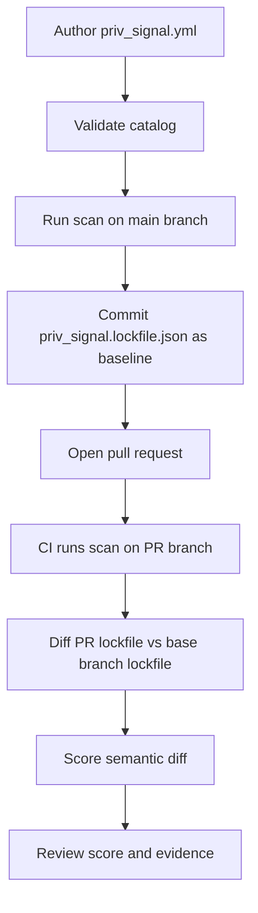

# PrivSignal

PrivSignal is an Elixir CLI for detecting privacy drift in application code during CI. It lets engineering teams define a versioned catalog of privacy-relevant data in `priv_signal.yml`, generate a deterministic lockfile from the codebase, and then score pull requests by comparing the PR's generated lockfile against the baseline on the target branch.

The primary use case is PR review: PrivSignal helps surface when a change introduces new handling of personal data, expands exposure to logs or telemetry, changes boundaries such as HTTP or controller responses, or otherwise invalidates the privacy assumptions your team has already documented. It is not a compliance engine and it does not replace legal or privacy review. It provides an explainable signal that tells reviewers when a change is worth a closer look.

The same scanning primitives are also useful outside PR scoring. You can run `mix priv_signal.scan` as a repository audit to find privacy-relevant touchpoints such as logging, telemetry, controller responses, outbound HTTP calls, database access, and LiveView exposure patterns.

## How It Works



Typical workflow:

1. Create `priv_signal.yml` to describe the privacy-relevant fields and modules in your system.
2. Run `mix priv_signal.validate` to confirm the config is structurally valid.
3. Run `mix priv_signal.scan` on your default branch to generate `priv_signal.lockfile.json`.
4. Commit both files. The lockfile becomes the baseline artifact PrivSignal compares against in future PRs.
5. In CI for a pull request, run `mix priv_signal.scan` again to generate a fresh lockfile for the proposed code.
6. Run `mix priv_signal.diff --base <target-branch-ref>` to compute the semantic privacy diff between the committed base artifact and the PR artifact.
7. Run `mix priv_signal.score --diff ...` to turn that diff into a deterministic privacy risk score and summary.

## Quick Start

Generate a starter config:

```bash
mix priv_signal.init
```

Validate the catalog:

```bash
mix priv_signal.validate
```

Generate the baseline lockfile:

```bash
mix priv_signal.scan
git add priv_signal.yml priv_signal.lockfile.json
git commit -m "add PrivSignal baseline"
```

Score a pull request locally:

```bash
mix priv_signal.scan --json-path tmp/pr.lockfile.json
mix priv_signal.diff \
  --base origin/main \
  --candidate-path tmp/pr.lockfile.json \
  --artifact-path priv_signal.lockfile.json \
  --format json \
  --output tmp/privacy_diff.json
mix priv_signal.score --diff tmp/privacy_diff.json --output tmp/priv_signal_score.json
```

If you want `scan` to fail on parse or scan errors, use strict mode:

```bash
mix priv_signal.scan --strict --json-path tmp/pr.lockfile.json
```

## Configuration

PrivSignal uses a repository-root `priv_signal.yml` file as the source of truth for the privacy catalog. At minimum, you define `prd_nodes` that map privacy-relevant fields to the Elixir modules where they live.

Example:

```yaml
version: 1

prd_nodes:
  - key: user_email
    label: User Email
    class: direct_identifier
    sensitive: true
    scope:
      module: MyApp.Accounts.User
      field: email

  - key: user_id
    label: User ID
    class: persistent_pseudonymous_identifier
    sensitive: false
    scope:
      module: MyApp.Accounts.User
      field: user_id

  - key: engagement_score
    label: Engagement Score
    class: inferred_attribute
    sensitive: false
    scope:
      module: MyApp.Analytics.UserProfile
      field: engagement_score

scanners:
  logging:
    enabled: true
    additional_modules: []
  http:
    enabled: true
    additional_modules: []
    internal_domains: []
    external_domains: []
  controller:
    enabled: true
    additional_render_functions: []
  telemetry:
    enabled: true
    additional_modules: []
  database:
    enabled: true
    repo_modules: []
  liveview:
    enabled: true
    additional_modules: []
```

The generated `priv_signal.lockfile.json` is not intended to be hand-edited. Treat it as a checked-in baseline artifact produced by `mix priv_signal.scan`.

## Commands

`mix priv_signal.init`

- Creates a starter `priv_signal.yml` in the current directory.

`mix priv_signal.validate`

- Validates `priv_signal.yml` against the current codebase and config schema.

`mix priv_signal.scan`

- Runs deterministic static analysis and writes `priv_signal.lockfile.json` by default.
- Common flags: `--json-path PATH`, `--strict`, `--quiet`, `--timeout-ms N`, `--max-concurrency N`.

`mix priv_signal.diff --base <ref>`

- Compares the current or supplied candidate lockfile against the lockfile on the base ref.
- Supports `--candidate-path`, `--candidate-ref`, `--artifact-path`, `--format`, `--include-confidence`, `--strict`, and `--output`.

`mix priv_signal.score --diff <path>`

- Consumes a semantic diff JSON artifact and writes a deterministic score JSON artifact.
- Supports `--output`, `--quiet`, and `--help`.

## What `scan` Looks For

PrivSignal currently scans for privacy-relevant usage across these categories:

- Logging sinks such as `Logger` and configured wrappers.
- Outbound HTTP calls and boundary changes.
- Controller response exposure.
- Telemetry and analytics exports.
- Database reads and writes.
- LiveView assigns, render paths, and event exposure.

This is why `scan` is useful both as the first step in the PR scoring workflow and as a standalone audit tool.

## CI Example

```yaml
name: PrivSignal

on:
  pull_request:

jobs:
  priv_signal:
    runs-on: ubuntu-latest
    steps:
      - uses: actions/checkout@v4
        with:
          fetch-depth: 0

      - uses: erlef/setup-beam@v1
        with:
          elixir-version: "1.18"
          otp-version: "27"

      - run: mix deps.get
      - run: mix priv_signal.validate
      - run: mix priv_signal.scan --json-path tmp/pr.lockfile.json
      - run: mix priv_signal.diff --base origin/main --candidate-path tmp/pr.lockfile.json --artifact-path priv_signal.lockfile.json --format json --output tmp/privacy_diff.json
      - run: mix priv_signal.score --diff tmp/privacy_diff.json --output tmp/priv_signal_score.json
```

This assumes `priv_signal.lockfile.json` is already committed on the base branch.

## Inventory Bootstrap Skill

This repository includes an installable AI coding skill at [`skills/priv-signal-inventory/SKILL.md`](skills/priv-signal-inventory/SKILL.md) that helps bootstrap `priv_signal.yml` for Elixir codebases. It is designed for Codex- and Claude Code-style agent workflows and can inspect local schemas, infer likely PRD nodes, and produce a high-confidence first pass of the catalog.

Use it when the hardest part of adoption is building the initial privacy catalog. It can significantly reduce the manual effort required to identify candidate modules, fields, aliases, and database wrapper boundaries before you validate and refine the file yourself.

## Installation

PrivSignal is an Elixir project targeting Elixir `~> 1.18`.

If you want to add it as a dependency from source:

```elixir
def deps do
  [
    {:priv_signal, git: "https://github.com/marmot-labs/priv-signal.git"}
  ]
end
```
